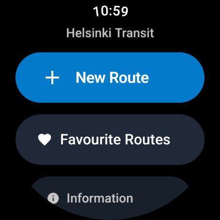
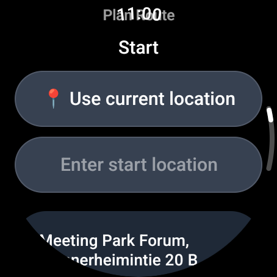
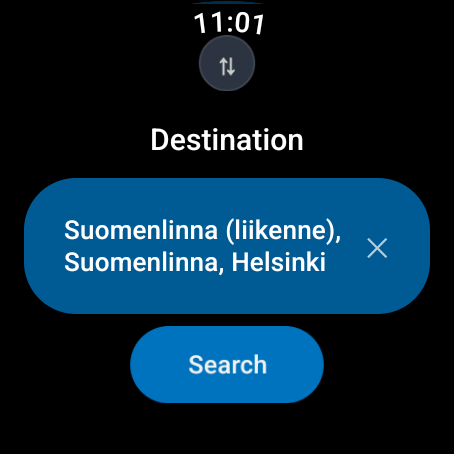
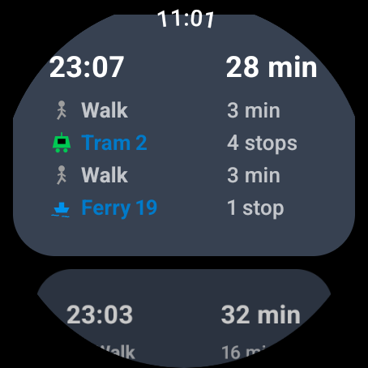
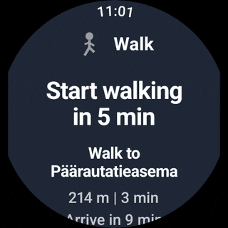
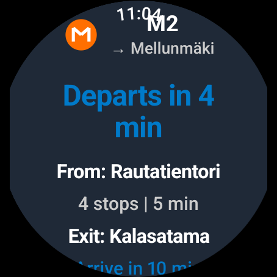
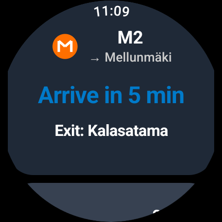
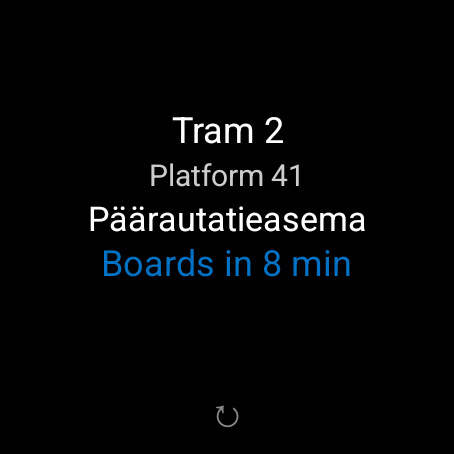
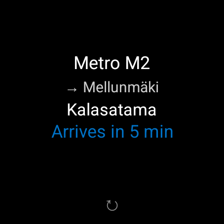

# HSL Wear - Helsinki Transit Watch App

[](https://wearos.google.com/)
[](https://kotlinlang.org/)
[](https://developer.android.com/jetpack/compose)
[](LICENSE)
[]()

> ⚠️ **Important Notice**: This is an unofficial, independent application and is **not affiliated with, endorsed by, or connected to HSL (Helsinki Regional Transport Authority)** in any way. This app uses HSL's public APIs to provide transit information but is developed and maintained independently.

A smartwatch application for Wear OS that provides real-time public transportation guidance for the Helsinki Region (HSL). The app is designed to be ultra-minimalist, focusing on providing essential transit information at a glance during your journey.

**Complete watch-only solution** - no companion phone app required. Plan routes, track journeys, and navigate Helsinki's public transit entirely from your wrist.

## Screenshots

<table>
  <tr>
    <td><br/><em>Home Screen</em></td>
    <td><br/><em>Location Search</em></td>
    <td><br/><em>Search Button</em></td>
  </tr>
  <tr>
    <td><br/><em>Available Routes</em></td>
    <td><br/><em>Route Navigation</em></td>
    <td><br/><em>Departure Information</em></td>
  </tr>
  <tr>
    <td><br/><em>Leg Arrival</em></td>
    <td><br/><em>Tile Boards</em></td>
    <td><br/><em>Tile Arrivals</em></td>
  </tr>
</table>

The app features a clean, watch-optimized interface designed for glanceable information with real-time transit updates.

## Features

### 🎯 Core Functionality
- **Smart Route Planning**: Plan journeys between any two locations in Helsinki region with location autocomplete
- **Step-by-Step Navigation**: Leg-by-leg guidance through your transit journey with real-time updates
- **Offline Resilient**: Routes persist even when app is closed or watch restarts
- **Battery Efficient**: Zero GPS usage, no background services, minimal network calls
- **Watch-Only Design**: Complete functionality without requiring a companion phone app

### 🔄 Real-Time Transit Intelligence
- **Live Trip Status**: Real-time delay information and departure updates for all transit legs
- **Smart Countdowns**: Dynamic "Boards in X min"/"Arrives in X min" with second precision
- **Automatic Leg Progression**: Intelligent advancement between transit segments during journey
- **Multi-Trip Monitoring**: Batch status queries for current and upcoming journey legs
- **Delay Indication**: Visual indicators (blue highlighting) when real-time data is available

### 📱 Advanced Wear OS Tile Integration
- **Timeline-Based Tiles**: Wear OS ProtoLayout with automatic leg switching based on schedule
- **Smart Content Display**: Transport mode, platform codes, and journey status on watch face
- **Deep Link Integration**: Tile clicks open app directly at current journey leg
- **Manual Refresh Capability**: User-initiated tile updates for on-demand information
- **Route Obsolescence Management**: Automatic cleanup 2 minutes after final arrival

### 📱 User Interface
- **Watch-First Design**: Optimized specifically for Wear OS small screens and round displays
- **Text Input**: Use on-watch keyboard for location input with autocomplete suggestions
- **One-Tap Operation**: All essential actions accessible with minimal interaction
- **Glanceable Information**: Large text, clear icons, countdown timers for quick reading
- **Deep Linking**: Tile integration with direct navigation to current journey leg
- **Visual Feedback**: Color-coded real-time indicators and delay status
- **Smart Timeline**: Automatic content updates based on journey progress

### 🚦 Transit Modes Supported
- Bus (including regional buses)
- Tram
- Metro (Subway)
- Train (Commuter and long-distance)
- Ferry
- Walking directions

### 🎫 HSL Fare Zones
- Visual zone indicators (A, B, C, D) for route planning and fare calculation
- Zone transition display showing departure and arrival zones
- Integrated zone information in route cards and navigation screens

## Architecture

### Technology Stack
- **Platform**: Wear OS 3.0+ (Android API 30+)
- **UI Framework**: Jetpack Compose for Wear OS
- **Architecture**: Clean Architecture with MVVM and Repository Pattern
- **Dependency Injection**: Hilt
- **Persistence**: Jetpack DataStore with JSON serialization
- **Networking**: OkHttp with HSL Digitransit GraphQL API
- **Real-time Updates**: GraphQL trip status queries
- **Tile Framework**: Wear OS ProtoLayout with timeline-based updates
- **Location**: Fused location provider with multiple fallback strategies

### Key Design Principles
1. **Ultra-Minimalist**: Each screen has one clear purpose with focused information
2. **Battery Efficient**: Zero GPS usage, no background services, no continuous polling
3. **Resilient**: State survives app kills, watch reboots, and network interruptions
4. **Accessible**: Large touch targets and high contrast UI
5. **Independent**: Complete functionality without phone companion app

## App Architecture

### Screen Flow
1. **Home Screen**: Start new route or resume active journey (if exists)
2. **Location Input**: Combined from/to input with autocomplete suggestions
3. **Route Selection**: Choose from 3-4 itinerary options with duration and mode details
4. **Route Tracking**: Step through each leg with departure times, platforms, and countdowns
5. **Journey Completion**: Finish route and return to home screen

### Data Flow
```
Location Input → Autocomplete → Route Planning → Route Selection → Active Navigation
      ↓              ↓              ↓                 ↓                   ↓
  Text Input    GraphQL API    GraphQL API       Save to Store      Current Leg
      ↓              ↓              ↓                 ↓                   ↓
  User Types    Stop Matches   3-4 Routes      DataStore JSON    Real-time Updates
                                                            ↓
                                                    Tile Integration ← Timeline Updates
```

### State Persistence & Battery Optimization
The app uses Jetpack DataStore with JSON serialization for optimal battery life:
- **Zero GPS Usage**: All location data from stop coordinates and schedules
- **No Background Services**: App only active when screen is visible
- **Efficient Networking**: Minimal API calls during route planning and optional realtime updates
- **Smart Recovery**: Seamless resume with <1 second restoration time after app closure
- **Automatic Cleanup**: Route obsolescence management 2 minutes after final arrival
- **Offline Capability**: Previously planned routes available without network connection
- **Typical Usage**: <2% battery drain per 30-minute journey

## Building the Project

### Prerequisites
- JDK 17 or higher
- Kotlin 2.0.21+
- Android SDK with Wear OS components

### Setup Steps
1. Clone the repository
2. Copy the example configuration file:
   ```bash
   cp local.properties.example local.properties
   ```
3. Add your HSL API key to `local.properties`:
   ```properties
   # Get your API key from: https://digitransit.fi/en/developers/api-registration/
   HSL_API_KEY=your_actual_api_key_here
   ```
4. Open in Android Studio
5. Sync project with Gradle files
6. Create a Wear OS emulator or connect a physical device
7. Run the app

### Build Configuration
- **Min SDK**: API 30 (Wear OS 2.0+)
- **Target SDK**: API 35 (Wear OS 5.0+)
- **Compile SDK**: API 35

## Key Dependencies

### Core Libraries
- **Hilt**: Dependency injection framework (`com.google.dagger:hilt-android`)
- **Compose for Wear OS**: Modern UI toolkit (`androidx.wear.compose:compose-material`)
- **OkHttp**: HTTP client with coroutine support (`com.squareup.okhttp3:okhttp`)
- **Kotlinx Serialization**: JSON parsing (`org.jetbrains.kotlinx:kotlinx-serialization-json`)
- **DataStore**: Modern replacement for SharedPreferences (`androidx.datastore:datastore-preferences`)
- **ProtoLayout**: Wear OS tile framework (`androidx.wear.protolayout:protolayout`)

### Architecture Components
- **ViewModel**: MVVM pattern with lifecycle awareness
- **Coroutines & Flow**: Asynchronous programming and reactive streams
- **Navigation Compose**: Declarative navigation between screens

## Development

### Code Style & Patterns
- **Kotlin Conventions**: Follow official Kotlin formatting and naming conventions
- **Compose Naming**: Use descriptive names for Compose functions (e.g., `RouteInputScreen`, `CurrentLegCard`)
- **Repository Pattern**: All data access through repositories with proper error handling
- **MVVM Architecture**: ViewModels handle business logic, UI state management with `StateFlow`
- **Dependency Injection**: Use Hilt for all dependencies, properly scoped to application/activity

### Debugging & Troubleshooting

#### Build Issues
If you encounter serialization or incremental compilation errors:
```bash
# Quick fix for Kotlin serialization cache issues
./gradlew compileDebugKotlin --rerun-tasks

# Full clean for stubborn issues
./gradlew clean assembleDebug
```

#### Common Problems
- **"Cannot access class" errors**: Usually build cache corruption, not code issues
- **Tile not updating**: Check `CurrentLegTileService` logs for errors
- **API failures**: Verify HSL API key in `local.properties` and network connectivity

### Development Workflow
1. **Feature Development**: Create new UI components in `ui/components/`
2. **State Management**: Add new ViewModels and UI states in `ui/viewmodel/` and `ui/models/`
3. **Data Layer**: Extend repositories and add new models in `data/`
4. **Testing**: Write unit tests for new functionality
5. **Integration**: Update navigation and ensure proper error handling

## API Integration

### Endpoints
- **Base URL**: `https://api.digitransit.fi/routing/v1/routers/hsl/index/graphql`
- **Location Search**: GraphQL geocoding query for stop autocomplete
- **Route Planning**: GraphQL plan query returning multiple itineraries
- **Real-time Data**: Stop departure times with realtime delay information

### Data Models
- **Location**: Stop or address with coordinates and GTFSId
- **Leg**: Individual journey segment (walk, bus, tram, metro, train, ferry)
- **Itinerary**: Complete journey with multiple legs and total duration
- **RouteState**: Active navigation state with current leg index, persisted to DataStore

## Wear OS Optimizations

### Platform-Specific Features
- Material Design 3 for Wear OS (Wear Compose) with modern theming
- Optimized for round and square watch faces with proper curved layouts
- Large touch targets following Wear OS accessibility guidelines
- Rotary input support for smooth scrolling through route lists and selections
- Tile integration with ProtoLayout for glanceable journey information on watch face

## File Structure

```
app/src/main/java/com/hsl/wear/
├── data/
│   ├── models/
│   │   ├── TransitModels.kt      # Core domain models (Location, Leg, Itinerary)
│   │   └── GraphQLModels.kt      # API response models
│   ├── repository/
│   │   ├── TransitRepository.kt  # Interface for transit data operations
│   │   └── HslRepository.kt      # HSL-specific implementation
│   ├── store/
│   │   └── RouteStore.kt         # DataStore persistence layer
│   └── mappers/
│       ├── GeocodingMapper.kt     # Location data transformation
│       └── GraphQLResponseMapper.kt # API response mapping
├── ui/
│   ├── screens/
│   │   ├── HomeScreen.kt         # Entry point with resume/start options
│   │   ├── RouteInputScreen.kt   # Location input (combined from/to)
│   │   ├── RouteSelectionScreen.kt   # Itinerary list
│   │   ├── RouteTrackingScreen.kt    # Active navigation
│   │   ├── FavouriteRoutesScreen.kt  # Saved routes management
│   │   ├── LocationPermissionScreen.kt # Location permission request
│   │   └── InfoScreen.kt         # App information
│   ├── models/
│   │   ├── HomeUiState.kt
│   │   ├── LocationInputState.kt
│   │   ├── LocationInputCallbacks.kt
│   │   ├── RouteSelectionUiState.kt
│   │   └── RouteTrackingUiState.kt
│   ├── viewmodel/
│   │   ├── HomeViewModel.kt
│   │   ├── RouteInputViewModel.kt
│   │   ├── RoutePlanningViewModel.kt
│   │   ├── RouteSelectionViewModel.kt
│   │   ├── RouteTrackingViewModel.kt
│   │   └── FavouriteRoutesViewModel.kt
│   ├── components/
│   │   ├── routeinput/           # Input-related components
│   │   ├── route/                # Route display components
│   │   ├── ZoneBadge.kt          # HSL fare zone badges and displays
│   │   ├── MiniRoutePreview.kt   # Compact route display
│   │   ├── TransportModeIcon.kt   # Transport mode icons
│   │   └── NavigationActions.kt   # Navigation action buttons
│   └── theme/
│       └── Theme.kt              # Material3 Wear OS theme
├── tiles/
│   ├── CurrentLegTileService.kt  # Wear OS tile service
│   └── components/
│       ├── TileTransitContent.kt # Tile content display
│       ├── TileEmptyContent.kt   # Empty state tile
│       ├── TileRefreshButton.kt   # Manual refresh button
│       └── DynamicTextHelper.kt # Dynamic text formatting
├── network/
│   ├── GraphQLClient.kt          # OkHttp-based GraphQL client
│   ├── GraphQLQueries.kt         # Query string templates
│   └── GeocodingClient.kt        # Location search client
├── location/
│   └── LocationProvider.kt       # Location services provider
├── di/                           # Hilt dependency injection modules
│   ├── DataModule.kt
│   ├── NetworkModule.kt
│   └── RepositoryModule.kt
├── navigation/
│   └── AppNavigation.kt          # Compose navigation setup
├── utils/
│   ├── constants/                # App constants
│   │   ├── TransportModeConstants.kt
│   │   ├── NetworkConstants.kt
│   │   ├── ColorConstants.kt
│   │   ├── ZoneConstants.kt        # HSL fare zone constants
│   │   ├── UIConstants.kt
│   │   ├── LocationConstants.kt
│   │   └── TimeConstants.kt
│   ├── TimeFormatter.kt
│   ├── LocationUtils.kt
│   ├── ZoneUtils.kt              # HSL fare zone utilities and formatting
│   ├── DistanceFormatter.kt
│   └── ErrorMessages.kt
├── HslWearApplication.kt         # Application class
└── MainActivity.kt               # Main entry point
```

## Contributing

Contributions are welcome! Whether it's bug fixes, new features, or documentation improvements.

## License

This project is licensed under the MIT License - see the [LICENSE](LICENSE) file for details.

**Important**: This app uses HSL's public Digitransit API. Please review HSL's API terms of service for any commercial usage restrictions or rate limiting requirements.

## Roadmap

### Current Version (v1.0)
- **Core Features**: Complete route planning and navigation with step-by-step guidance
- **State Persistence**: Journey survival across app closure and watch reboots
- **Input Methods**: On-watch keyboard with location autocomplete
- **Real-time Updates**: Live departure times, delay information, and countdown displays
- **Tile Integration**: Wear OS timeline tiles with automatic leg switching
- **Smart Refresh**: Manual and automatic data refresh capabilities
- **Deep Linking**: Direct navigation from tiles to current journey leg
- **Multi-modal Support**: Bus, Tram, Metro, Train, Ferry, and Walking directions
- **Offline Capability**: Route persistence without network connection

### Future Enhancements
- Favorite locations (Home, Work)
- Recent routes for quick repeat
- Route history log
- Pre-departure notifications
- Watch face complications
- Offline stop database for faster autocomplete
- Haptic feedback on leg transitions
- Multi-language support (Finnish, Swedish, English)
